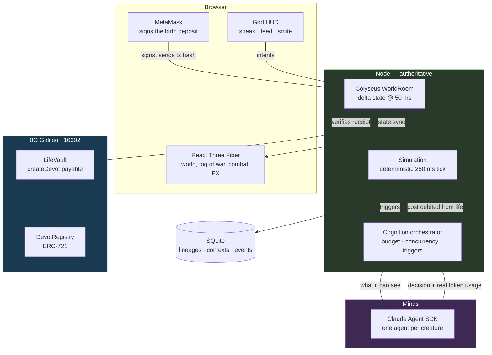
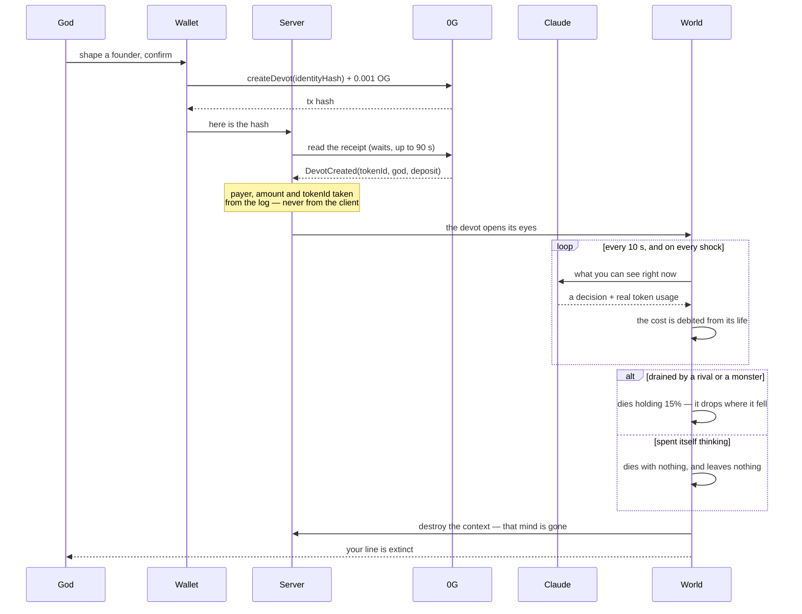
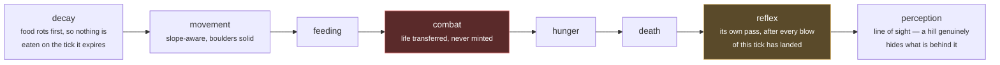
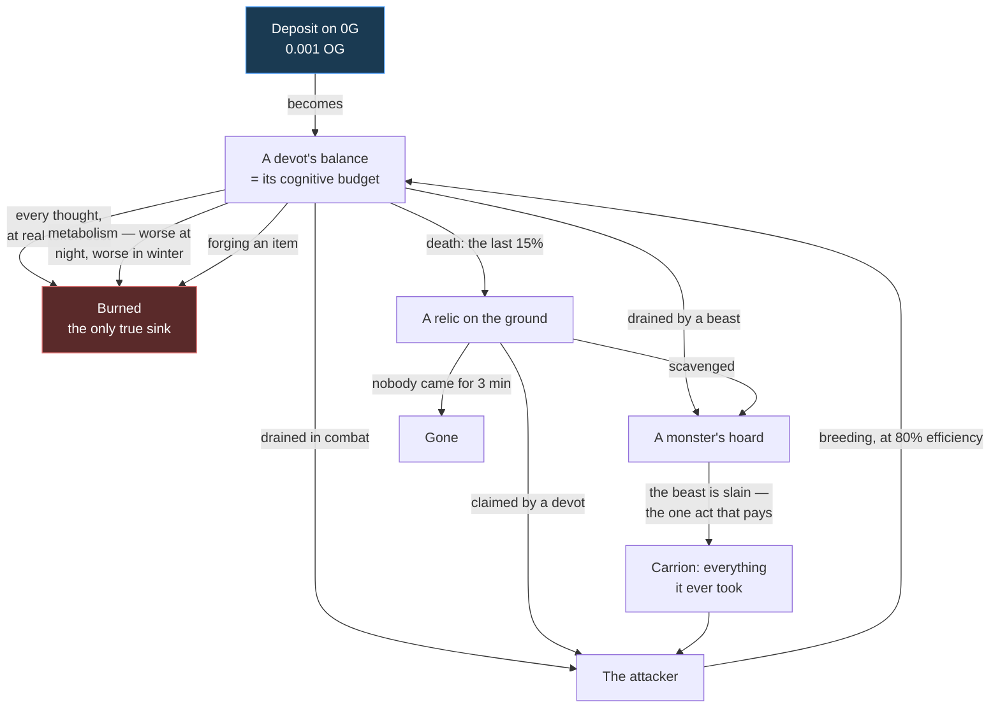

# Devot

> **You are a god. Your faithful are real AI agents. Thinking costs them their life.**
>
> Every devot in this world is a Claude agent that perceives, deliberates and acts.
> The tokens it burns to think are debited from an **on-chain deposit made on 0G** —
> and that deposit *is* its life. When it runs out, the creature dies, its context is
> destroyed forever, and whatever it still held drops on the ground for a monster or a
> rival to take.

**Built at ETHGlobal Lisbon 2026** · [Showcase](https://ethglobal.com/showcase/undefined-u3djs) · [Source](https://github.com/flphth/devot)

---

## The world


<table>
  <tr>
    <td width="50%"><br><em>Shaping a founder: look, stats, traits and soul, inside one point budget the server re-checks.</em></td>
    <td width="50%"><br><em>The Mind panel: every thought a devot has ever had, and what each one cost it.</em></td>
  </tr>
  <tr>
    <td width="50%"><br><em>Predation: life transferred from victim to attacker, in full view.</em></td>
    <td width="50%"><br><em>The birth deposit, signed by the player in their own wallet on 0G Galileo.</em></td>
  </tr>
</table>

**▶ [Watch the demo](docs/media/demo.mp4)**

---

## What makes it different

Most "AI agent" games script the behaviour and dress it up as intelligence. Devot does
the opposite: **nothing is hardcoded.** A devot is given what it can see and asked what
it wants to do. Whether it flees, hunts, forages, breeds, forges a weapon or talks to its
neighbour is the model's call, every time.

That would be an expensive toy if thinking were free. It isn't:

| | |
| --- | --- |
| **A thought has a price** | The real `usage` returned by the inference is converted into life and subtracted. Not a simulation of a cost — the actual token count. |
| **A life is a budget** | A devot's balance *is* its remaining cognition. Roughly seventy thoughts, and that is a life. |
| **Death is real** | When the balance reaches zero the context rows are deleted from SQLite. That mind is gone; nothing restores it. |
| **Value is conserved** | Nothing is minted by the simulation. Life moves between bodies, into monsters' hoards, onto the ground as relics — and is burned only by thinking. |

The result is a world where **deliberation is a survival cost**, and where a creature
that overthinks starves next to one that acted.

---

## How 0G makes it work

Devot's core mechanic is impossible without a chain: a life has to be *bought* with
something real, or "thinking costs you your life" is just a number in a server's RAM.
**0G Galileo (chain `16602`) is where a devot's life comes from and where its identity
lives.**

| What | Where | On 0G |
| --- | --- | --- |
| **The deposit that creates life** | [`LifeVault.sol#L71`](contracts/src/LifeVault.sol#L71) | `createDevot(identityHash)` **payable** — the OG sent becomes the creature's starting balance |
| **A devot is an NFT** | [`DevotRegistry.sol`](contracts/src/DevotRegistry.sol) | A hand-written minimal **ERC-721**: a lineage is an on-chain object, not a server record |
| **The player pays, not the server** | [`wallet.ts#L116`](apps/client/src/wallet.ts#L116) | The god signs the deposit in their own wallet (injected EIP-1193 / MetaMask) |
| **The server verifies rather than trusts** | [`vault.ts#L145`](packages/onchain/src/vault.ts#L145) | Reads the receipt back off 0G; payer, amount and tokenId all come from the event log |
| **No transaction, no birth** | [`WorldRoom.ts#L407`](apps/server/src/rooms/WorldRoom.ts#L407) | The one place in the whole simulation allowed to block on a network |
| **A wallet per creature** | [`wallet.ts`](packages/onchain/src/wallet.ts) | One address per devot, HD-derived from a single seed — keys are derived, never stored |

**Deployed vault:** [`0x30B5E767917695B9268948DB872aa3c22EBba62D`](https://chainscan-galileo.0g.ai/address/0x30B5E767917695B9268948DB872aa3c22EBba62D) · **Cost of a life:** 0.001 OG

The server never trusts a field the client sends. A transaction hash is a bearer token
until it is spent, so a spent deposit is recorded in the database and **stays spent across
restarts** — otherwise one payment would mint devots forever. And an event log is only
believed if it came from *our* vault address: a lookalike contract emitting its own
`DevotCreated` would otherwise mint free creatures.

> **Why 0G specifically.** The birth is the one moment the simulation is allowed to wait
> on a network — everything else is netted and batched so the 250 ms tick never blocks.
> That only works if confirmation is fast and cheap enough to sit inside a player's
> character-creation flow, which is exactly what Galileo gave us.

---

## How it works

### The shape of the thing



### A life, from deposit to relic



### One tick, 250 ms, zero tokens

The body keeps living between two thoughts. The order matters, and every line of it was
paid for in bugs:



### Where value goes, and where it does not

Nothing in the simulation mints life. It only ever changes hands, or is burned by thought:



A monster is the world's only **sink that can be reversed**: it takes life out of
circulation and holds it, and the only way that value comes home is if something kills it.
That is what makes a fat beast worth crossing the map for.

---

## What a devot actually knows

Before every thought a devot is handed a picture of its own situation, bounded by its own
eyesight — which is exactly the circle the player sees lit through the fog:

```
The sun is low and the light is going. Autumn.

A monster, Beast-3, has fallen upon you and is tearing your life away.

Your situation:
· Since your last thought you have LOST 1,240 balance. You are bleeding out.
· You are running out. Food is not the only life within reach: every devot and
  every monster around you is carrying some, and attacking takes it.
· Has attacked you before: Beast-3.
· You are down in a hollow: the rises around you hide what lies beyond them,
  and hide you too.

Around you, as far as you can see (beyond this you know nothing):
- A MONSTER, Beast-3, 1.2 away, carrying a hoard of 24,180 taken from the dead — HUNTING YOU
- Adam-son 412, of your own line, 6.4 away, starving, carrying a spear
- a RELIC left by Eve, holding 9,000 in funds, 8.1 away. It will NOT feed you —
  it goes to your god, who needs it to make more of you.
```

It answers with a structured decision — `idle`, `move`, `eat`, `flee`, `attack`, `speak`,
`craft` or `reproduce` — plus a private thought and an emotion, both of which surface in
the UI. Nothing steers it toward any of them.

**Bodies act between thoughts.** A thought can be seconds away, queued behind another
creature's or waiting on the budget, so the body has reflexes: a devot with a monster's
teeth in it turns and fights whatever its mind last decided, and a starving one walks to
the nearest meal it can actually see. The next thought can overrule any of it — that is
the point of having a reflex rather than a rule.

---

## The world itself

| | |
| --- | --- |
| **Relief and line of sight** | Terrain generated from a seeded hash on both sides, never synced. Hills genuinely occlude — for perception, not just for the camera. Climbing costs speed. |
| **Day, night and seasons** | A two-minute day, seasons every two days. Night makes existing more expensive and **predators see further**. Winter starves the map. |
| **Monsters** | They hunt, hoard what they take, and starve if they stop. They think too, on a cheaper tier — the world is dangerous without being expensive. Their number scales with the living, and one never appears within sight of anyone. |
| **Food that rots** | It appears at random and expires, so the map is never a stable larder and waiting is never free. |
| **Boulders and meadow** | 134 boulders (solid — bodies slide around them) and ~1,050 flowers, laid out on a jittered grid so the whole map is populated rather than a few lucky patches. |
| **Many gods, one world** | Two browsers, two `?god=` names, one shared world. Lineages compete for the same food and the same corpses. |
| **Reproduction** | Budding or sexual, across rival lines. The child inherits look, stats and — through a chronicler pass — condensed **memories of a life it never lived**. |

---

## Quick start

```sh
pnpm install
pnpm --filter @devot/server dev   # world on ws://localhost:2567
pnpm --filter @devot/client dev   # http://localhost:5173?god=YourName
```

Open `http://localhost:5173?god=YourName`, shape your founder, sign the deposit, then
click its body to speak to it, feed it, or strike it down. A second browser with a
different `?god=` puts another god in the same world.

**Requirements:** Node ≥ 22, pnpm ≥ 9. For a birth to cost anything you need a wallet
holding 0G Galileo testnet OG; with no chain configured the world still runs, and says so
out loud rather than quietly handing out creatures for free.

### Which mind runs the creatures

Set `MIND` in `.env` (see [`.env.example`](.env.example)):

| `MIND=` | Backend | Cost |
| --- | --- | --- |
| `claude` *(default)* | Your **Claude Code subscription**, via the Agent SDK | subscription quota — **no per-token billing** |
| `api` | Messages API with `ANTHROPIC_API_KEY` | pay-per-token |
| `mock` | Simulated minds, offline | free |

Nothing to configure if Claude Code is installed and signed in: the default works as-is.

### Chain configuration

```sh
ZG_RPC_URL=https://evmrpc-testnet.0g.ai
LIFEVAULT_ADDRESS=0x30B5E767917695B9268948DB872aa3c22EBba62D
DEVOT_DEPOSIT_WEI=1000000000000000    # 0.001 OG
```

The client offers to add 0G Galileo to MetaMask if the wallet has never seen it.

---

## Commands

```sh
pnpm typecheck                      # tsc --noEmit across every package
pnpm test                           # 207 tests
pnpm p0                             # headless: one devot is born, thinks, eats, dies
pnpm --filter @devot/server smoke   # end-to-end: real room, mock mind, in-memory DB

cd contracts && forge test          # the vault's conservation invariant, fuzzed
```

---

## Layout

```
apps/server        Colyseus WorldRoom — the authority. Nothing is decided anywhere else.
apps/client        Vite + React + React Three Fiber, MetaMask, i18n (FR/EN)
packages/shared    types, constants, terrain, props, world clock, decision schema
packages/sim       the reactive layer: the deterministic systems of the 250 ms tick
packages/agents    minds: prompts, model tiers, real cost → life, orchestrator
packages/db        SQLite (better-sqlite3 + Drizzle), append-only migrations
packages/onchain   LifeVault client, a wallet per devot, batched life ledger
contracts          LifeVault.sol + DevotRegistry.sol (Foundry, solc 0.8.24)
```

Deeper reading: [`ARCHITECTURE.md`](./ARCHITECTURE.md) (technical) and [`PLAN.md`](./PLAN.md)
(game design). The `docs/G*` files are the on-chain proofs: the conservation invariant was
written *before* the contract, then verified from both the TypeScript and the Solidity side.

---

## Stack

**TypeScript** · **Solidity 0.8.24** · **GLSL**
Colyseus · React 19 · React Three Fiber · Three.js · Vite
Claude Agent SDK · SQLite + Drizzle
Foundry · ethers v6 · **0G Galileo (16602)**

---

<div align="center">
<em>Every creature in this world is really thinking, and it is really dying of it.</em>
</div>
